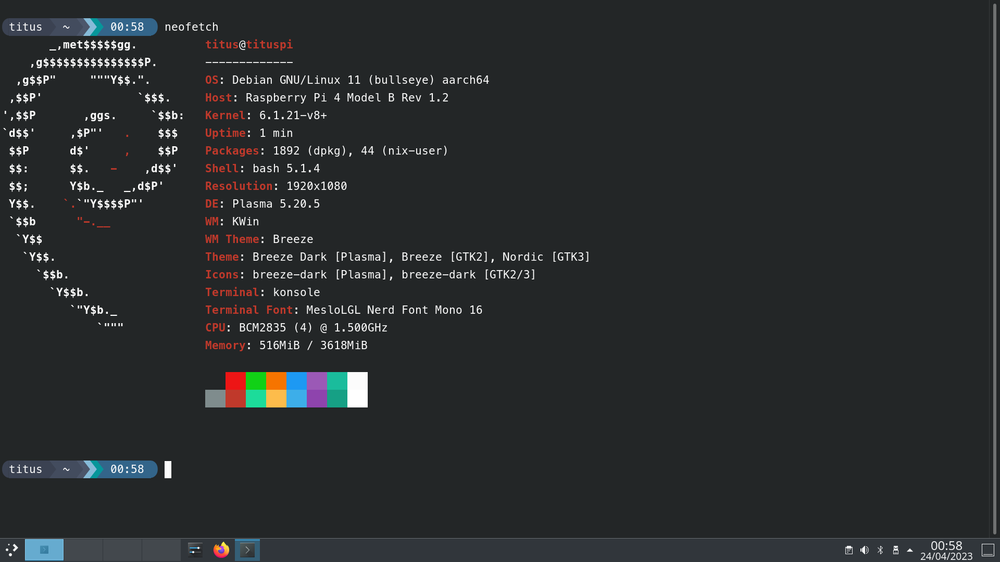
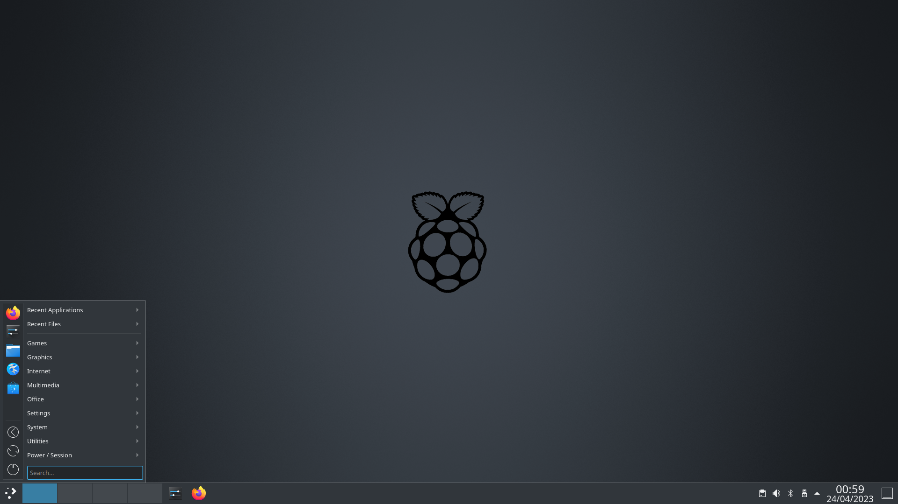
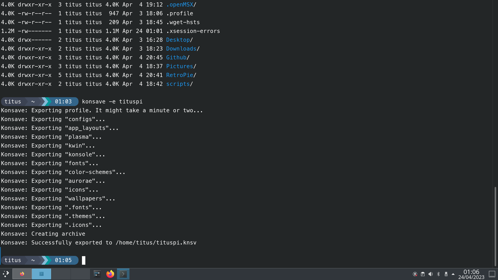

# Official IMG file Download

- TitusPi 1 (AwesomeWM 2020) - In Releases Download
- [TitusPi 2 (BSPWM) 2022](https://projects.christitus.com/tituspi2.img.gz)
- [TitusPi 3 (KDE) 2023](https://projects.christitus.com/tituspi3-2023-04.zip)

**Version 1/2/3 does NOT support RaspberryPi 5**

You can build it yourself for FREE by following the instructions below. 

## TitusPi Version 3 (2023 Edition)

| Terminal      | Desktop       | KDE Profile   |
|:-------------:|:-------------:|:-------------:|
||||

This version is designed for max stability and ease of use. The build instructions are simplistic and only require minor tweaks for the raspberrypi. 

### Build instructions

- Install Raspberry Pi OS LITE (NOT THE DESKTOP)
- From console on login use `tasksel` and select KDE
- Modify KDE to DISABLE composition in KWIN (Massive performance boost)
- Modify `/boot/cmdline.txt` for leverage graphics acceleration and other boot modifications (quiet boot). 
- Use [konsave](https://github.com/Prayag2/konsave) and tituspi.knsv (extracted from tituspi.7z files - 7Zip Required) to copy fonts, KDE settings and more!

```
disable_splash=1
disable_overscan=1
hdmi_group=1
hdmi_mode=4
hdmi_drive=2
hdmi_ignore_cec_init=1
arm_freq=2048
v3d_freq=750
over_voltage=6
dtparam=i2c_arm=on
dtparam=audio=on
enable_uart=1
[pi4]
dtoverlay=vc4-fkms-v3d
[all]
hdmi_enable_4kp60=1
```


#### boot cmdline.txt explanations

<www.raspberrypi.org/documentation/hardware/raspberrypi/revision-codes/README.md>
<www.cnx-software.com/2020/02/24/raspberry-pi-4-rev-1-2-fixes-usb-c-power-issues-improves-sd-card-resilience/>

Seems my RPi4 version is more sensitive to what chargers I can use, therefore limiting overclocking options.

```
cat /proc/cpuinfo | grep Revision
```

> Revision: c03111

##### Overclocking

Reference: <www.raspberrypi.org/documentation/configuration/config-txt/overclocking.md>

These are the speeds I achieved with arm_freq=2048. arm_freq=2047 reports a lower scaling_max_freq which can be noticed in games like God of War: Chains of Olympus (one of the games I used as benchmark). v3d_freq=750 is the max GPU overclock, over_voltage=6 required to provide extra juice (over_voltage=5 worked for me with arm_freq=2000).

```
cat /sys/devices/system/cpu/cpu0/cpufreq/scaling_max_freq
```

> 2194967

```
echo performance > /sys/devices/system/cpu/cpu0/cpufreq/scaling_governor
```

> vcgencmd measure_clock arm
> frequency(48)=2048519552

As for hdmi_enable_4kp60=1 I also use it for overclocking reasons, as the only way to increase the GPU core_freq from 500 to 550, enable_tvout underclocks to 360:
"Specific to Pi 4B: The core_freq of the Raspberry Pi 4 can change from the default if either hdmi_enable_4kp60 or enable_tvout are used, due to relationship between internal clocks and the particular requirements of the requested display modes."

##### HDMI options and resolution

Reference: <www.raspberrypi.org/documentation/configuration/config-txt/video.md>

hdmi_group=1, hdmi_mode=4, hdmi_drive=2 : these options set the RPi at 16:9 720p using the standard CEA TV timings and sending audio through HDMI.

hdmi_ignore_cec_init=1 "prevents a CEC-enabled TV from coming out of standby and channel-switching when you are rebooting your Raspberry Pi."
Channel switching on reboots was quite annoying indeed :)

##### No gpu_mem parameters??

Reference: <www.raspberrypi.org/documentation/configuration/config-txt/memory.md>

That's right! :) "On the Raspberry Pi 4 the 3D component of the GPU has its own memory management unit (MMU), and does not use memory from the gpu_mem allocation. Instead memory is allocated dynamically within Linux. This may allow a smaller value to be specified for gpu_mem on the Pi 4, compared to previous models." Note: Still recommended for Pi 3's if using for emulation!

The performance of N64 Conker's Bad Fur Day increased noticeably after removing all gpu_mem parameters.

Information pulled from retropie community forum: <https://retropie.org.uk/forum/topic/27430/howto-optimized-boot-config-txt>

### RetroPie Addition

Check official documentation from RetroPie @ <https://retropie.org.uk/docs/Manual-Installation/>

## TitusPi Verison 1/2 - A Raspberry Pi Desktop Distribution that doesn't suck

### Original work by PapyElGringo, he is now developing [material-shell](https://github.com/PapyElGringo/material-shell) for GNOME

An almost desktop environment made with [AwesomeWM](https://awesomewm.org/) following the [Material Design guidelines](https://material.io) with a performant opiniated mouse/keyboard workflow to increase daily productivity and comfort.


| Tiled         | Panel         | Exit screen   |
|:-------------:|:-------------:|:-------------:|
||||

## Before you Start

I have created two different systems for TitusPi. Below you will find two paths... Arch Install or Raspbian OS Install. Choose one and DO NOT run commands for both.

- Raspbian OS Install - Completed
- Arch ARM OS Install - Pi3 Arch in testing - Pi4 Arch not built

*These instructions are not complete as there are components missing to build the base OS install.* (Xorg and other dependencies) If you have ever built arch before you will be familiar with the build process. It is almost identical - https://wiki.archlinux.org/index.php/installation_guide . I will update the project with each build, but it will take a long time before the instructions will be complete due to the complexity of building this. 

Any extra scripts and modifications I made is in the `extras` folder in this project. The script I use for changing to tty1 to run emulationstation or the emulationstation.desktop file are extras I have added. 

Other modifications to the systems:
- modified Polkit to automatically elevate programs (This is a security flaw)
- autologin via tty AND gui - This is needed for the emulationstation script
- RetroPie install - I manually chose the packages and used its setup scripts for screensaver modification and other minor tweaks
- Raspi-config - I recommend installing this package on the install for configurations and tweaks

## Download

- For Raspbian installs - Grab the Lite Image (600MB) @ https://www.raspberrypi.org/downloads/raspberry-pi-os/
- For Arch installs - Grab the ARM image @ https://archlinuxarm.org/about/downloads - _Note: Raspberry Pi Images are on Platforms -> Version -> Broadcom -> Raspberry Pi_


## Arch Base Installation

### Root Pacman Setup

```bash
pacman -S xorg xorg-drivers mesa lightdm lightdm-gtk-greeter base-devel vim nano sudo clang cmake git gcc glibc networkmanager
```
### Yay Install with User (DO NOT USE ROOT)

```bash
git clone "https://aur.archlinux.org/yay.git"
cd yay
makepkg -si
```

### Service Setup on Boot

```bash
sudo systemctl enable NetworkManager
sudo systemctl enable lightdm
sudo systemctl enable systemd-timesyncd
```

## Raspberry Pi OS Base Installation 

*Work In Progress* - Look at the Arch install and install those packages (Note: some are a bit different because of the package manager differences)

## Material Awesome Setup

### Raspbian-Based

```
sudo apt install awesome fonts-roboto rofi compton i3lock xclip qt5-style-plugins materia-gtk-theme lxappearance xbacklight flameshot nautilus xfce4-power-manager pnmixer network-manager-gnome policykit-1-gnome terminator chromium gedit nautilus -y
wget -qO- https://git.io/papirus-icon-theme-install | sh
```

*Note: picom replaced with compton in pi because of ARM Architecture*

### Arch-Based

```
yay -S awesome rofi picom i3lock-fancy xclip ttf-roboto polkit-gnome materia-gtk-theme lxappearance flameshot pnmixer network-manager-applet xfce4-power-manager terminator chromium gedit nautilus -y
wget -qO- https://git.io/papirus-icon-theme-install | sh
```

### Program list

- [AwesomeWM](https://awesomewm.org/) as the window manager - universal package install: awesome
- [Roboto](https://fonts.google.com/specimen/Roboto) as the **font** - Debian: fonts-roboto Arch: ttf-roboto
- [Rofi](https://github.com/DaveDavenport/rofi) for the app launcher - universal install: rofi
- Compton - This is depreciated, but the new picom is not supported in ARM yet
- [i3lock](https://github.com/meskarune/i3lock-fancy) the lockscreen application universal install: i3lock-fancy
- [xclip](https://github.com/astrand/xclip) for copying screenshots to clipboard package: xclip
- [gnome-polkit] recommend using the gnome-polkit as it integrates nicely for elevating programs that need root access
- [Materia](https://github.com/nana-4/materia-theme) as GTK theme - Arch Install: materia-theme debian: materia-gtk-theme
- [Papirus Dark](https://github.com/PapirusDevelopmentTeam/papirus-icon-theme) as icon theme Universal Install: wget -qO- https://git.io/papirus-icon-theme-install | sh
- [lxappearance](https://sourceforge.net/projects/lxde/files/LXAppearance/) to set up the gtk and icon theme
- (Laptop) [xbacklight](https://www.x.org/archive/X11R7.5/doc/man/man1/xbacklight.1.html) for adjusting brightness on laptops (disabled by default)
- [flameshot](https://flameshot.js.org/#/) my personal screenshot utility of choice, can be replaced by whichever you want, just remember to edit the apps.lua file
- [pnmixer](https://github.com/nicklan/pnmixer) Audio Tray icon that is in debian repositories and is easily installed on arch through AUR.
- [network-manager-applet](https://gitlab.gnome.org/GNOME/network-manager-applet) nm-applet is a Network Manager Tray display from GNOME.
- [xfce4-power-manager](https://docs.xfce.org/xfce/xfce4-power-manager/start) XFCE4's power manager is excellent and a great way of dealing with sleep, monitor timeout, and other power management features.

### Clone the configuration

```
git clone https://github.com/ChrisTitusTech/TitusPi.git ~/.config/awesome
```

### Set the themes

Start `lxappearance` to active the **icon** theme and **GTK** theme
Note: for cursor theme, edit `~/.icons/default/index.theme` and `~/.config/gtk3-0/settings.ini`, for the change to also show up in applications run as root, copy the 2 files over to their respective place in `/root`.

### Same theme for Qt/KDE applications and GTK applications, and fix missing indicators

First install `qt5-style-plugins` (debian) | `qt5-styleplugins` (arch) and add this to the bottom of your `/etc/environment`

```bash
XDG_CURRENT_DESKTOP=Unity
QT_QPA_PLATFORMTHEME=gtk2
```

The first variable fixes most indicators (especially electron based ones!), the second tells Qt and KDE applications to use your gtk2 theme set through lxappearance.

### Changing the Matrial Awesome Theme

The documentation live within the source code.

The project is split in functional directories and in each of them there is a readme where you can get additional information about the them.

* [Configuration](./configuration) is about all the **settings** available
* [Layout](./layout) hold the **disposition** of all the widgets
* [Module](./module) contain all the **features** available
* [Theme](./theme) hold all the **aesthetic** aspects
* [Widget](./widget) contain all the **widgets** available

## Extra Packages for Quality of Life

```bash
yay -S raspi-config pulseaudio pavucontrol
```

* [My ZSH](https://github.com/ChrisTitusTech/zsh)
* [PowerLevel10k](https://github.com/romkatv/powerlevel10k)
